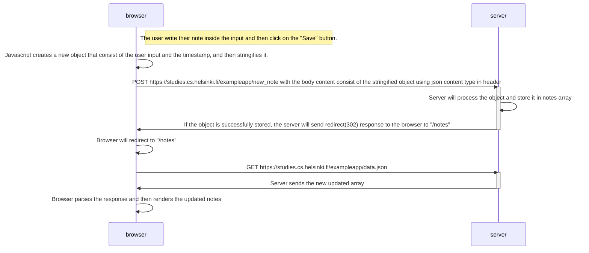

# New note diagram

```mermaid
sequenceDiagram;
    participant browser;
    participant server;

    Note right of browser: The user write their note inside the input and then click on the "Save" button.;

    browser->>browser: Javascript creates a new object that consist of the user input and the timestamp, and then stringifies it.;

    browser->>server: POST https://studies.cs.helsinki.fi/exampleapp/new_note with the body content consist of the stringified object using json content type in header;
    activate server;
    server->>server: Server will process the object and store it in notes array;
    server->>browser: If the object is successfully stored, the server will send redirect(302) response to the browser to "/notes";
    deactivate server;

    browser->>browser: Browser will redirect to "/notes"
    browser->>server: GET https://studies.cs.helsinki.fi/exampleapp/data.json;
    activate server;
    server->>browser: Server sends the new updated array;
    deactivate server;

    browser->>browser: Browser parses the response and then renders the updated notes;
```