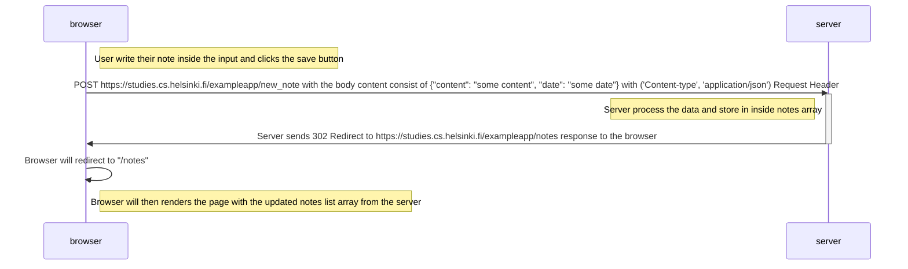

# New note diagram

```mermaid
sequenceDiagram;
    participant browser;
    participant server;

    Note right of browser: User write their note inside the input and clicks the save button;

    browser->>server: POST https://studies.cs.helsinki.fi/exampleapp/new_note with the body content consist of {"content": "some content", "date": "some date"} with ('Content-type', 'application/json') Request Header;
    activate server;
    Note left of server: Server process the data and store in inside notes array;
    server->>browser: Server sends 302 Redirect to https://studies.cs.helsinki.fi/exampleapp/notes response to the browser;
    deactivate server;

    browser->>browser: Browser will redirect to "/notes";
    Note right of browser: Browser will then renders the page with the updated notes list array from the server
```