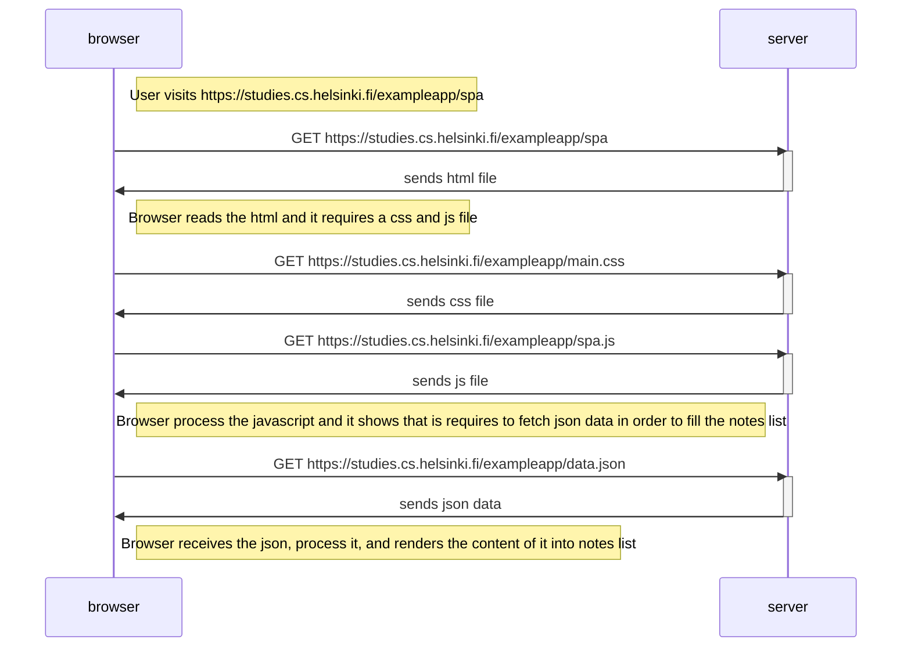

# Single Page App Diagram

```mermaid
sequenceDiagram;
    participant browser;
    participant server;

    Note right of browser: User visits https://studies.cs.helsinki.fi/exampleapp/spa

    browser->>server: GET https://studies.cs.helsinki.fi/exampleapp/spa
    activate server;
    server->>browser: sends html file;
    deactivate server;

    Note right of browser: Browser reads the html and it requires a css and js file

    browser->>server: GET https://studies.cs.helsinki.fi/exampleapp/main.css
    activate server;
    server->>browser: sends css file;
    deactivate server;

    browser->>server: GET https://studies.cs.helsinki.fi/exampleapp/spa.js;
    activate server;
    server->>browser: sends js file;
    deactivate server;

    Note right of browser: Browser process the javascript and it shows that is requires to fetch json data in order to fill the notes list

    browser->>server: GET https://studies.cs.helsinki.fi/exampleapp/data.json
    activate server;
    server->>browser: sends json data;
    deactivate server;

    Note right of browser: Browser receives the json, process it, and renders the content of it into notes list
```